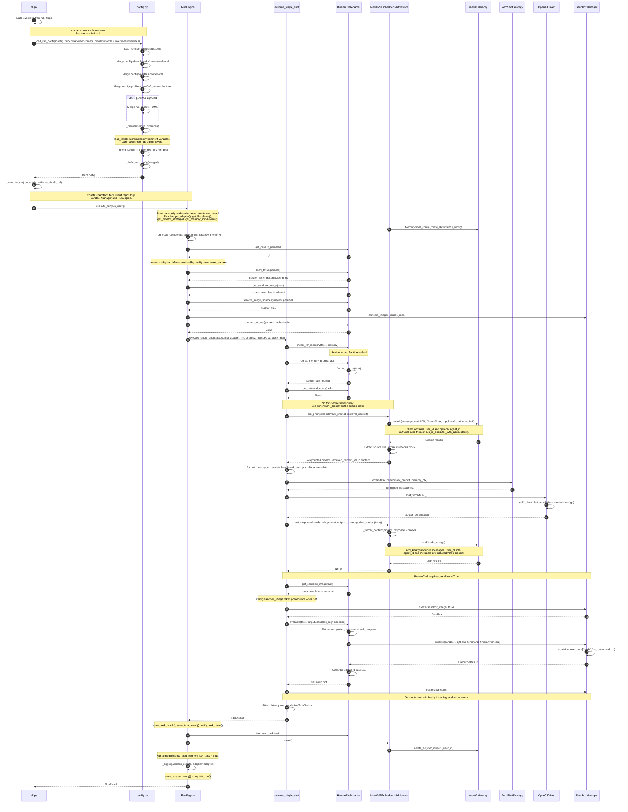

```mermaid
flowchart TD
    User["User / automation"]

    subgraph ConfigFiles["Root configuration files"]
        Defaults["configs/default.toml"]
        BenchConfig["configs/benchmarks/*.toml<br/>[run], [benchmark]"]
        Profiles["configs/profiles/*.toml<br/>[run], [benchmark], [system.*]"]
        RunFile["Optional run TOML<br/>--config"]
        SealConfig["configs/seal/cache_control.yaml<br/>configs/seal/str_replace_nudge.yaml"]
    end

    subgraph Application["src/cross_bench/"]
        CLI["CLI — cli.py<br/>Typer app; run(); _execute_run()"]
        Config["Configuration — config.py<br/>load_run_config(); load_toml(); _merge()<br/>Environment interpolation; memory config inheritance"]
        Models["Domain models — models.py<br/>RunConfig; SystemConfig; Task; TaskResult; RunResult"]
        Parallel["parallel_runner.py<br/>run_parallel()<br/>Isolated CLI subprocess per task"]
        Engine["RunEngine — execution/engine.py<br/>execute_run()<br/>_run_code_gen(); _run_conversational()"]

        AdapterRegistry["benchmarks/registry.py<br/>register_adapter(); get_adapter()<br/>_REGISTRY; _ALIASES"]
        Adapters["Benchmark adapters — benchmarks/<br/>BenchmarkAdapter; ConversationalBenchmarkAdapter<br/>14 concrete adapters"]

        SystemsRegistry["systems/registry.py<br/>get_llm_driver()<br/>get_memory_middleware()<br/>get_prompt_strategy()"]
        Prompting["PromptStrategy — systems/prompting/<br/>ZeroShotStrategy; FewShotStrategy<br/>ChainOfThoughtStrategy; RetrievalAugmentedStrategy"]
        LLM["LLMDriver — systems/llm/<br/>OpenAIDriver; GenericOpenAIDriver<br/>AnthropicDriver; AnthropicBedrockDriver"]
        Memory["MemoryMiddleware — systems/memory/<br/>pre_prompt(); post_response(); reset()"]
        APIMemory["API provider keys<br/>mem0v1_api; mem0v2_api; evermemos_api<br/>hindsight_api; mastra_api; letta_api; zep_api"]
        EmbeddedMemory["Embedded / local provider keys<br/>mem0v1_embedded; mem0v2_embedded<br/>evermemos_embedded; hindsight_embedded<br/>mastra_embedded; memos_embedded<br/>graphiti_embedded; zep_embedded; rag"]
        Embeddings["systems/embedding/<br/>OpenAIEmbeddingDriver; OllamaEmbeddingDriver<br/>SentenceTransformerDriver"]

        Modes["execution/modes.py<br/>execute_single_shot(); execute_agentic()<br/>execute_conversational(); execute_gold_eval()"]
        Mini["execution/scaffolds/mini_swe_agent.py<br/>execute_mini_swe_agent()"]
        Seal["execution/scaffolds/seal.py<br/>execute_seal()"]
        Sandbox["execution/sandbox.py<br/>SandboxManager; Sandbox; ExecutionResult<br/>create(); execute(); write_file(); apply_patch(); destroy()"]

        Evaluation["evaluation/<br/>provider_prompts.py; retrieval_metrics.py; memscore.py<br/>benchmarks/llm_judge.py"]
        Artifacts["artifact_store.py<br/>ArtifactStore"]
        Results["results/repository.py<br/>ResultRepository / NullResultRepository"]
    end

    Data["Benchmark datasets / upstream harnesses<br/>data/locomo/; data/longmemeval/<br/>third_party/swebench_pro/<br/>Installed packages / downloaded datasets"]
    SWEAgent["third_party/swe_agent/<br/>SWE-agent subprocess / LiteLLM"]
    ModelServices["LLM / embedding services<br/>OpenAI; Anthropic; Bedrock<br/>OpenAI-compatible endpoints / Ollama"]
    MemoryServices["Memory SDKs, services and stores"]
    Docker["Docker containers<br/>execution/docker_templates/ under src/cross_bench/<br/>or benchmark-specific images"]
    Storage["Local artifacts/ and optional S3"]
    Database["PostgreSQL"]

    User --> CLI
    CLI -->|"--parallel greater than 1"| Parallel
    Parallel -->|"cross-bench run per task"| CLI
    CLI -->|"benchmark, profiles, config_path, overrides"| Config
    Defaults -->|"1: defaults"| Config
    BenchConfig -->|"2: benchmark defaults"| Config
    Profiles -->|"3: later profiles win"| Config
    RunFile -->|"4: run-specific values"| Config
    Config -->|"builds RunConfig; CLI overrides applied last"| Models
    Models -->|"resolved configuration"| CLI
    CLI -->|"construct dependencies; execute_run()"| Engine

    Engine -->|"config.benchmark"| AdapterRegistry
    AdapterRegistry -->|"instantiate registered class / resolve alias"| Adapters
    Adapters -->|"load_tasks(); load_conversations()"| Data

    Engine -->|"system.llm; system.memory; system.prompt_strategy"| SystemsRegistry
    SystemsRegistry --> LLM
    SystemsRegistry --> Memory
    SystemsRegistry --> Prompting
    SystemsRegistry -.->|"get_embedding_driver() exists; not called by RunEngine"| Embeddings
    Memory --> APIMemory
    Memory --> EmbeddedMemory
    APIMemory --> MemoryServices
    EmbeddedMemory -->|"provider-owned SDKs / stores"| MemoryServices
    EmbeddedMemory -->|"provider-owned LLM / embedding clients"| ModelServices
    LLM --> ModelServices
    Embeddings -->|"where applicable"| ModelServices

    Engine -->|"single_shot / agentic / gold_eval; conversational pipeline"| Modes
    Engine -->|"run.execution_mode = mini_swe_agent"| Mini
    Engine -->|"run.execution_mode = seal"| Seal

    Modes -->|"format(); chat() / complete()"| Prompting
    Modes --> LLM
    Modes -->|"pre_prompt(); post_response()"| Memory
    Modes -->|"prompt hooks; evaluate()"| Adapters
    Mini -->|"chat()"| LLM
    Mini -->|"pre_prompt(); post_response()"| Memory
    Mini -->|"evaluate()"| Adapters
    Mini --> Sandbox

    SealConfig --> Seal
    Seal --> SWEAgent
    SWEAgent -->|"owns model calls"| ModelServices
    Seal -->|"optional mem0 LiteLLM hook"| MemoryServices
    Seal -->|"evaluate generated patch"| Adapters

    Engine -->|"prefetch_images()"| Sandbox
    Modes -->|"sandbox lifecycle when required"| Sandbox
    Adapters -->|"benchmark-specific execution / grading"| Sandbox
    Sandbox --> Docker
    Engine -->|"conversational prompts and metrics"| Evaluation
    Adapters -->|"optional answer judging"| Evaluation

    Engine --> Artifacts
    Engine --> Results
    Artifacts --> Storage
    Results -->|"ResultRepository only"| Database
```

```mermaid
classDiagram
    direction TB

    class BenchmarkAdapter {
        <<abstract>>
        name: str
        granularity: TaskGranularity
        requires_sandbox: bool = True
        reset_memory_per_task: bool = True
        load_tasks(params: dict[str, Any]) Iterator~Task~*
        evaluate(task: Task, generated_output: str, sandbox_mgr: SandboxManager, sandbox: Sandbox | None = None) dict[str, Any]*
        get_sandbox_image(task: Task | None = None) str*
        format_prompt(task: Task) str
        format_memory_prompt(task: Task) str
        get_retrieval_query(task: Task) str | None
        ingest_for_memory(task: Task, memory: MemoryMiddleware) None
        corpus_for_run(params: dict[str, Any] | None = None, tasks: list[Task] | None = None) AsyncIterator[CorpusItem] | None
        resolve_image_sources(images: Iterable[str], params: dict[str, Any] | None = None) dict[str, str]
        teardown_task(task: Task) None
        get_default_params() dict[str, Any]
        metrics_schema() list[str]
    }

    class ConversationalBenchmarkAdapter {
        <<abstract>>
        requires_sandbox: bool = False
        load_conversations(params: dict[str, Any]) list[dict[str, Any]]
        evaluate(task: Task, generated_output: str, sandbox_mgr: SandboxManager, sandbox: Sandbox | None = None) dict[str, Any]
        judge_answer(task: Task, generated_answer: str) dict[str, Any]
        get_sandbox_image(task: Task | None = None) str
    }

    class HumanEvalAdapter {
        name = "humaneval"
    }
    class HumanEvalPlusAdapter {
        name = "humaneval_plus"
        requires_sandbox = False
    }
    class MBPPAdapter {
        name = "mbpp"
    }
    class MBPPPlusAdapter {
        name = "mbpp_plus"
        requires_sandbox = False
    }
    class BigCodeBenchAdapter {
        name = "bigcodebench"
    }
    class LiveCodeBenchAdapter {
        name = "livecodebench"
        requires_sandbox = False
    }
    class RepoBenchAdapter {
        name = "repobench"
        requires_sandbox = False
    }
    class CrossCodeEvalAdapter {
        name = "crosscodeeval"
        requires_sandbox = False
    }
    class SWEBenchAdapter {
        name = "swebench"
    }
    class TerminalBenchAdapter {
        name = "terminalbench"
    }
    class LoCoMoOriginalAdapter {
        name = "locomo_original"
    }
    class LoCoMoEverosAdapter {
        name = "locomo_everos"
    }
    class LongMemEvalAdapter {
        name = "longmemeval"
    }
    class ConvoMemAdapter {
        name = "convomem"
    }

    class adapter_registry["benchmarks/registry.py"] {
        <<module>>
        _REGISTRY: dict[str, type[BenchmarkAdapter]]
        _ALIASES: dict[str, str]
        _BUILTINS_LOADED = False
        register_adapter(cls: type[BenchmarkAdapter]) type[BenchmarkAdapter]
        get_adapter(name: str) BenchmarkAdapter
        list_benchmarks() list[str]
        _ensure_builtins_loaded() None
    }

    class Task {
        <<dataclass>>
        task_id: str
        benchmark: str
        granularity: TaskGranularity
        prompt: str
        metadata: dict[str, Any]
        context_files: list[dict[str, str]] | None = None
        ground_truth: Any | None = None
    }

    class TaskGranularity {
        <<enumeration>>
        FUNCTION = "function"
        CONTEST = "contest"
        CROSS_FILE = "cross_file"
        REPO = "repo"
        TERMINAL = "terminal"
        CONVERSATIONAL = "conversational"
    }

    BenchmarkAdapter <|-- HumanEvalAdapter
    BenchmarkAdapter <|-- HumanEvalPlusAdapter
    BenchmarkAdapter <|-- MBPPAdapter
    BenchmarkAdapter <|-- MBPPPlusAdapter
    BenchmarkAdapter <|-- BigCodeBenchAdapter
    BenchmarkAdapter <|-- LiveCodeBenchAdapter
    BenchmarkAdapter <|-- RepoBenchAdapter
    BenchmarkAdapter <|-- CrossCodeEvalAdapter
    BenchmarkAdapter <|-- SWEBenchAdapter
    BenchmarkAdapter <|-- TerminalBenchAdapter
    BenchmarkAdapter <|-- ConversationalBenchmarkAdapter

    ConversationalBenchmarkAdapter <|-- LoCoMoOriginalAdapter
    ConversationalBenchmarkAdapter <|-- LoCoMoEverosAdapter
    ConversationalBenchmarkAdapter <|-- LongMemEvalAdapter
    ConversationalBenchmarkAdapter <|-- ConvoMemAdapter

    adapter_registry ..> BenchmarkAdapter : registers classes and instantiates subclasses
    adapter_registry ..> SWEBenchAdapter : resolves four aliases
    BenchmarkAdapter ..> Task : yields, formats and evaluates
    Task --> TaskGranularity : granularity
    BenchmarkAdapter --> TaskGranularity : granularity

    note for BenchmarkAdapter "src/cross_bench/benchmarks/base.py<br/>evaluate(), ingest_for_memory(), teardown_task() are async."
    note for ConversationalBenchmarkAdapter "base.py<br/>load_tasks() remains abstract.<br/>evaluate() awaits judge_answer(); both are async."
    note for adapter_registry "Every concrete adapter uses @register_adapter.<br/>Lazy imports populate _REGISTRY by cls.name.<br/>swebench_pro, swebench_pro_gold,<br/>swebench_pro_seal, swebench_gold all resolve to swebench."
    note for BigCodeBenchAdapter "Overrides reset_memory_per_task as a property<br/>to support a run-scoped corpus."
    note for Task "src/cross_bench/models.py<br/>metadata defaults to a fresh dict."
```

```mermaid
sequenceDiagram
    autonumber
    participant CLI as cli.py
    participant C as config.py
    participant E as RunEngine
    participant X as execute_single_shot
    participant A as HumanEvalAdapter
    participant M as Mem0V2EmbeddedMiddleware
    participant B as mem0.Memory
    participant P as ZeroShotStrategy
    participant L as OpenAIDriver
    participant S as SandboxManager

    CLI->>CLI: Build overrides from CLI flags
    Note over CLI,C: run.benchmark = humaneval<br/>benchmark.limit = 1
    CLI->>C: load_run_config(config, benchmark=benchmark, profiles=profiles, overrides=overrides)

    C->>C: load_toml(configs/default.toml)
    C->>C: Merge configs/benchmarks/humaneval.toml
    C->>C: Merge configs/profiles/online.toml
    C->>C: Merge configs/profiles/mem0v2_embedded.toml
    opt --config supplied
        C->>C: Merge run-specific TOML
    end
    C->>C: _merge(merged, overrides)
    Note over C: load_toml() interpolates environment variables.<br/>Later layers override earlier layers.
    C->>C: _inherit_bench_llm_into_memory(merged)
    C->>C: _build_run_config(merged)
    C-->>CLI: RunConfig

    CLI->>CLI: _execute_run(run_config, artifacts_dir, db_url)
    Note over CLI,E: Construct ArtifactStore, result repository,<br/>SandboxManager and RunEngine.
    CLI->>E: execute_run(run_config)
    Note over E: Store run config and environment, create run record.<br/>Resolve get_adapter(), get_llm_driver(),<br/>get_prompt_strategy(), get_memory_middleware().
    M->>B: Memory.from_config(config_dict=mem0_config)

    E->>E: _run_code_gen(config, adapter, llm, strategy, memory)
    E->>A: get_default_params()
    A-->>E: {}
    Note over E: params = adapter defaults overlaid by config.benchmark_params
    E->>A: load_tasks(params)
    A-->>E: Iterator[Task], materialized as list

    E->>A: get_sandbox_image(task)
    A-->>E: cross-bench-function:latest
    E->>A: resolve_image_sources(images, params)
    A-->>E: source_map
    E->>S: prefetch_images(source_map)

    E->>A: corpus_for_run(params, tasks=tasks)
    A-->>E: None

    E->>X: execute_single_shot(task, config, adapter, llm, strategy, memory, sandbox_mgr)
    X->>A: ingest_for_memory(task, memory)
    Note over A: Inherited no-op for HumanEval.
    X->>A: format_memory_prompt(task)
    A->>A: format_prompt(task)
    A-->>X: benchmark_prompt
    X->>A: get_retrieval_query(task)
    A-->>X: None

    Note over X,M: No focused retrieval query:<br/>use benchmark_prompt as the search input.
    X->>M: pre_prompt(benchmark_prompt, retrieval_context)
    M->>B: search(query=prompt[:500], filters=filters, top_k=self._retrieval_limit)
    Note over M,B: filters contains user_id and optional agent_id.<br/>SDK call runs through run_in_executor_with_accountant().
    B-->>M: Search results
    M->>M: Extract source IDs, format memories block
    M-->>X: Augmented prompt, retrieved_context_ids in context
    X->>X: Extract memory_ctx, update benchmark_prompt and task.metadata

    X->>P: format(task, benchmark_prompt, memory_ctx)
    P-->>X: formatted message list
    X->>L: chat(formatted, {})
    L->>L: self._client.chat.completions.create(**kwargs)
    L-->>X: output, StepRecord

    X->>M: post_response(benchmark_prompt, output, _memory_side_context(task))
    M->>M: _format_content(prompt, response, context)
    M->>B: add(**add_kwargs)
    Note over M,B: add_kwargs includes messages, user_id, infer,<br/>agent_id and metadata are included when present.
    B-->>M: Add results
    M-->>X: None

    Note over X,S: HumanEval requires_sandbox = True.
    X->>A: get_sandbox_image(task)
    A-->>X: cross-bench-function:latest
    Note over X: config.sandbox_image takes precedence when set.
    X->>S: create(sandbox_image, task)
    S-->>X: Sandbox

    X->>A: evaluate(task, output, sandbox_mgr, sandbox)
    A->>A: Extract completion, construct check_program
    A->>S: execute(sandbox, python3 command, timeout=timeout)
    S->>S: container.exec_run(["bash", "-c", command], ...)
    S-->>A: ExecutionResult
    A->>A: Compute pass and pass@1
    A-->>X: Evaluation dict
    X->>S: destroy(sandbox)
    Note over X,S: Destruction runs in finally, including evaluation errors.
    X->>X: Attach latency metrics, derive TaskStatus
    X-->>E: TaskResult

    Note over E: store_task_result(), save_task_result(), notify_task_done()
    E->>A: teardown_task(task)
    E->>M: reset()
    M->>B: delete_all(user_id=self._user_id)
    Note over E: HumanEval inherits reset_memory_per_task = True.
    E->>E: _aggregate(task_results, adapter=adapter)
    Note over E: store_run_summary(), complete_run()
    E-->>CLI: RunResult
```
